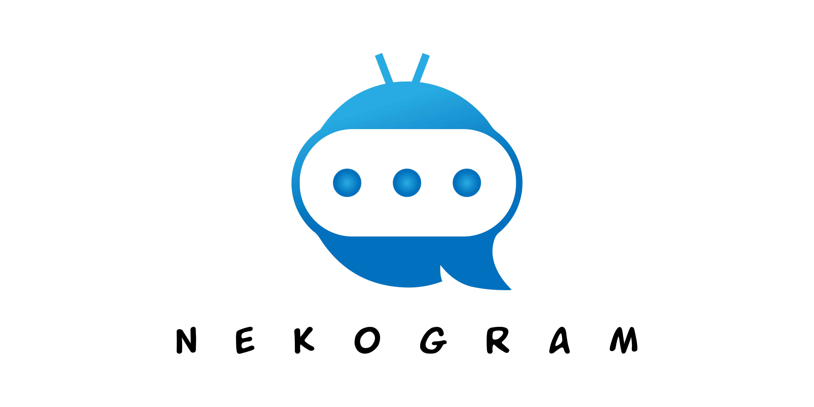
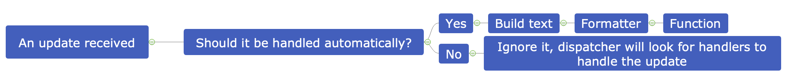
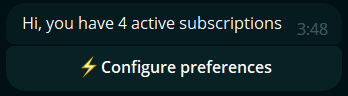
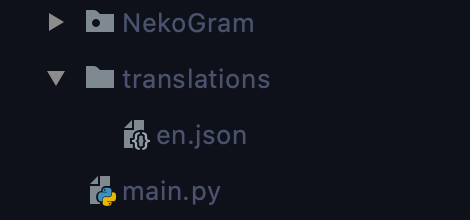

# NekoGram
###### Creating bots has never been simpler.
##### Join our [Telegram chat @NekoGramDev](https://t.me/NekoGramDev)
##### [YouTube tutorial (RU)](https://youtu.be/68i1blPYGYU)
##### [Example project](https://github.com/lyteloli/NekoGramBMICalculator)


## Overview
NekoGram is a data serialization format (JSON/YAML) processing layer framework over AIOGram, that makes bot 
development easier, faster and makes the code a lot more readable.

Its main features include:
- Multistep menus.
- Multibot support.
- Great localization support.
- Reducing the amount of code you need to create a bot.
- Widgets.
- Proper MySQL storage.
- Useful utils for various things, such as media upload that pure AIOGram lacks.
- Routers. You no longer need to link a bunch of handlers from various files in your project.
- Intermediate menus. These will be shown to users when you need some time to process inputs.
- Proper input filtration, without having to write a ton of handlers to notify users about wrong input.
- Freedom. You can combine any AIOGram feature with NekoGram if you need to do so.
- Cool exception messages :3

NekoGram is based on [AIOGram](https://github.com/aiogram/aiogram) which means you can combine all its features 
with NekoGram.

# Quick documentation
> Note: Always read the documentation for the release you are using, NekoGram is constantly evolving and newer 
> releases might be incompatible with older ones.

#### Current major version: 2.2
> ⚠️ This version implements changes that may be breaking, do not switch to it with existing projects unless you are 
> ready to resolve them.

> The latest version was not yet published to PyPi so if you want to use webhooks, please clone this repository.

## Installation
```
pip install NekoGram
```
OR
```
git clone https://github.com/lyteloli/NekoGram
```
Speedups:
```
pip install uvloop ujson cchardet aiodns
```
MySQL storage dependencies:
```
pip install aiomysql
```
PostgreSQL storage dependencies:
```
pip install asyncpg
```
SQLite storage dependencies:
```
pip install aiosqlite
```
YAMLProcessor text processor dependencies:
```
pip install pyyaml
```

## Structure, brief introduction and a bit of theory

> [Full image](docs/update-structure.png)

Everything is quite simple (wow, really..). Let's divide this theory into topics:
#### Idea of Menus
Firstly, what is a Menu? We can imagine it as a class that holds menus that should be displayed to users as they 
interact with your bot. For example you want to display the following menu to a user:
\
Programmatically it can be structured in many ways but NekoGram has its own strict Menu format which 
would look like this:
```json
"start": {
  "text": "Hi, you have {active_subscriptions} active subscriptions",
  "markup": [
    [{"text": "⚡️Configure preferences", "call_data": "menu_configure_preferences"}]
  ]
}
```
Let us go over the structure quickly. You can see a dictionary "start" which contains 2 fields: "text" and "markup".
"start" is the name of the menu we want to define, "text" is the text that will be displayed to our users. 
Within the value of "text" you can see `{active_subscriptions}`, which is a placeholder, you will understand how it 
works later as you progress through the docs. Markup field is the keyboard that will be displayed to users along 
with the text. Its structure is also quite simple, it is a 2 dimensional array of dictionaries. 
First dimension defines a list of keyboard rows with respect to row position. 
Second dimension defines a keyboard row (each row might have multiple buttons).
Dictionaries themselves define button objects, in this case we have an inline button, therefore it has a "text" field 
and "call_data" field which defines the callback your app will get once the button is clicked, this way you can 
understand which menu our user wants to go to.

#### How to define Menus?
For now NekoGram supports only JSON and YAML Menus, but you may override BaseProcessor text processor class to make it 
support more formats, if you decide to do so, please share it with others by submitting a pull request!
You may put the translation files anywhere and anyhow you want, though it is recommended to store them in a 
"translations" folder under the root folder of your app. 
Each file must have an [IETF language tag](https://en.wikipedia.org/wiki/IETF_language_tag) defined like this: 
`"lang": "en"`. Considering the previous Menu example, the whole file would look like this: 
```json
{
  "lang": "en",
  "start": {
    "text": "Hi, you have {active_subscriptions} active subscriptions",
    "markup": [
      [{"text": "⚡️Configure preferences", "call_data": "menu_configure_preferences"}]
    ]
  }
}
```
Now let us get back to our [scheme](#structure-brief-introduction-and-a-bit-of-theory).

#### What is an Update?
An Update is an AIOGram Message or CallbackQuery object, which is being fed to our app via AIOGram handlers.
NekoGram only handles messages when a user is working with a certain menu. As for calls (CallbackQueries) it handles 
only callbacks starting with predefined strings (menu_ and widget_ by default). If an update does not match these 
criteria it is being ignored and AIOGram takes care about it, so you may define 
lower-level AIOGram handlers if you need to handle something NekoGram cannot.

##### Update flow
When we have an update that should be handled we have a couple options (refer to the schema above). 
In any case a Menu object is being constructed in the first place. 
This object is a class representing your menu defined in JSON/YAML. 
It contains all the data from JSON/YAML file and a few useful methods.

#### What is called a Formatter?
Formatters are crucial part of NekoGram since they allow you to replace placeholders in your Menus with useful 
data for users. Formatter is being called when a menu is being built, which means formatter is called before 
a menu is being handled. Let us see an example of a Formatter, we will use the Menu we defined previously:
```python
from NekoGram import Neko, Menu
from aiogram.types import User
import random
NEKO = Neko(token='YOUR BOT TOKEN')  # Remember to initialize Neko beforehand


@NEKO.formatter()
async def start(data: Menu, _: User, __: Neko):
    await data.build(text_format={'active_subscriptions': random.randint(1, 100)})
```
Note that you do not need to return anything in Formatters, only call build function, which alters the Menu 
object in-place.


#### How to Filter?
NekoGram supports AIOGram filters but also has its own, simpler version. Here is an example for better understanding 
if you have any experience with AIOGram:
```python
from aiogram.types import Message, CallbackQuery
from aiogram.dispatcher.filters import Filter
from NekoGram.storages import BaseStorage
from typing import Dict, Union, Any


class HasMenu(Filter):
    def __init__(self, database: BaseStorage):
        self.database: BaseStorage = database

    @classmethod
    def validate(cls, _: Dict[str, Any]):
        return {}

    async def check(self, obj: Union[Message, CallbackQuery]) -> bool:
        return bool((await self.database.get_user_data(user_id=obj.from_user.id)).get('menu', False))
```
This filter checks if a user is interacting with any Menu at the moment. Let us say you want to use it in your app. 
Initialize a Neko like this:
```python
from NekoGram import Neko
NEKO: Neko = Neko(token='YOUR BOT TOKEN')
```
Now you may attach the filter in one of the following ways:
`NEKO.add_filter(name='has_menu', callback=HasMenu)`
`NEKO.add_filter(name='has_menu', callback=HasMenu.check)`
What if you are not familiar with AIOGram or do not want to write big classes for simple filters? 
Not a problem, use a simple version!
```python
from aiogram.types import Message, CallbackQuery
from typing import Union


async def is_int(obj: Union[Message, CallbackQuery]) -> bool:
    """
    Checks if message text can be converted to an integer
    :return: True if so
    """
    if isinstance(obj, CallbackQuery):  # Make sure we are working with Message text
        obj = obj.message
    return obj.text and obj.text.isdigit()
```
And attach it the following way: `NEKO.add_filter(name='int', callback=is_int)`.
Sounds simple, right? You may ask yourself why do you need to attach filters at all, the answer is because NekoGram 
validates user input automatically so that you do not have to write a ton of code.
Now, how can we make Neko do it for us? Let us define a simple menu:
```json
"menu_enter_age": {
  "text": "Please enter your age",
  "markup": [
    [{"text": "⬅️Back"}]
  ],
  "filters": ["int"],
  "validation_error": "Entered data is not an integer"
}
```
In this example we use a reply keyboard instead of inline, this is more useful when collecting user input.
We defined our filter by name in "filters" field and a "validation_error" which will be displayed to users in case 
their input did not pass our filters.
> Note: filters only apply for messages, not callbacks. Filters are called before functions.

#### What is a Function?
Well, the naming might be bad, but you will get used to it :)\
Functions give you freedom to do whatever, they are termination points of update handling process.
Let us consider an example. Remember the menu we defined to get user's age in the previous section? 
Now we will define another Menu where our user will see his age.
```json
"menu_result": {
  "text": "Your age is {age}, you look nice today!",
  "markup": [
    [{"text": "🆗", "call_data": "menu_start"}]
  ]
}
```
Now we can process the user input, let us define a function for that.
```python
from NekoGram import Neko, Menu
from aiogram.types import Message, CallbackQuery
from typing import Union
NEKO = Neko(token='YOUR BOT TOKEN')  # Remember to initialize a Neko beforehand


@NEKO.function()
async def menu_enter_age(_: Menu, message: Union[Message, CallbackQuery], __: Neko):
    data = await NEKO.build_menu(name='menu_result', obj=message, auto_build=False)
    await data.build(text_format={'age': message.text})
```
Here it is, notice how we can perform formatting within functions, but remember, a Menu must have no Formatter to do so
and you need to pass `auto_build=False` because Neko tries to build text automatically if it does not find a formatter.
> There is a special case: "start" Menu, which is an entrypoint of your bot. You may define a Function for this menu 
> to override default Neko behavior.

#### Routers
In order to structure your app better and to avoid circular imports NekoGram provides NekoRouters to register 
Functions and Formatters. It is recommended to use them instead of attaching Formatters and Functions to Neko object.
Example:
```python
from NekoGram import NekoRouter, Neko, Menu
from aiogram.types import User

NEKO = Neko(token='YOUR BOT TOKEN')  # Remember to initialize a Neko beforehand
ROUTER = NekoRouter()


@ROUTER.formatter()
async def test(data: Menu, user: User, neko: Neko):
    pass

NEKO.attach_router(ROUTER)  # Attach a router
```

#### App structure


This is an example project structure, you should structure all your Menus by relevant categories and within each 
category have separate files for Formatters and Functions. Later on attach the Routers to the Neko object.

## Deeper understanding of components
NekoGram has a lot of features, and it is always nice to have some reference, there you go.

#### Storages
Just like AIOGram, NekoGram uses its own storages to store user data. At the moment there are 3 types of 
storages available: MySQLStorage, PGStorage and a MemoryStorage, let us walk through each of them quickly.
##### MemoryStorage
As the name suggests, it stores data in your machine's memory, once you restart your app, all the data will be gone.
This storage is useful for tiny projects, testing and playing around with Neko.
##### MySQLStorage
The most advanced and recommended storage of NekoGram. It checks database structure every time your app launches, 
if you do not have a database, it will create it for you. It is recommended to use Widgets only with this storage.
##### PGStorage
A storage for PostgreSQL databases. Has basic features of MySQLStorage.
> This storage may not work properly, it is not recommended using it.

#### Menus in depth
Here are all possible properties of a Menu:
```json
"YOUR_MENU_NAME": {
  "text": "YOUR TEXT",
  "markup": [
    [{"text": "YOUR TEXT"}]
  ],
  "markup_row_width": 3,
  "no_preview": false,
  "parse_mode": "HTML",
  "silent": false,
  "validation_error": "YOUR ERROR TEXT",
  "extras": {
    "YOUR_CUSTOM_KEY": "YOUR CUSTOM VALUE"
  }
  "prev_menu": "YOUR PREVIOUS MENU NAME",
  "next_menu": "YOUR NEXT MENU NAME",
  "filters": ["int", "photo"]
}
```
Let us go over each of them:
- text: text to display to users
- markup: keyboard to display to users
- markup_row_width: row width of markup (max number of buttons per row)
- no_preview: whether to hide webpage previews
- silent: whether to deliver message without a notification
- validation_error: text to display to users in case of input not passing filters
- extras: a dictionary for any extra data
- prev_menu: previous menu in multi-step menus
- next_menu: next menu in multi-step menus
- filters: user input filters

#### Widgets
We strive for simplicity. That is why you have Widgets available, both builtin and third-party. 
You may create your own widget by copying the structure of any widget in NekoGram/widgets folder.
Some widgets may require extra database tables and Neko also takes care of that. It is recommended to use MySQLStorage 
when working with widgets.
##### How to attach a widget?
```python
from NekoGram.widgets import broadcast
from NekoGram import Neko
NEKO = Neko(token='YOUR BOT TOKEN')  # Remember to initialize Neko beforehand

async def _():
    await NEKO.attach_widget(formatters_router=broadcast.FORMATTERS_ROUTER, functions_router=broadcast.FUNCTIONS_ROUTER,
                             startup=broadcast.startup)
```
##### How to customize widgets?
There are a few methods that override parts of widget Menus. They are: prev_menu_handlers, next_menu_handlers, 
markup_overriders.
Let us try to customize the broadcast Widget to make it return user to our own defined menu, not to start Menu.

```python
from NekoGram import Neko, Menu
from typing import List, Dict
NEKO = Neko(token='YOUR BOT TOKEN') # Remember to initialize Neko beforehand

@NEKO.prev_menu_handler()
async def widget_broadcast(_: Menu) -> str:
    return 'menu_test'


@NEKO.markup_overrider(lang='en')  # Enter a language for which to override a keyboard
async def widget_broadcast_broadcast(_: Menu) -> List[List[Dict[str, str]]]:
    return [[{"text": "🆗", "call_data": "menu_test", "id": 2}]]
```
In this way we have overriden the menu to which widget entrypoint should return us 
(if a user decided not to perform a broadcast) and the termination point (when a user finished their broadcast).
We have overridden the Menus that are inside the 
[widget folder](https://github.com/lyteloli/NekoGram/blob/master/NekoGram/widgets/broadcast/translations/en.json)

##### Multi-step menus
NekoGram allows you to reduce the amount of code by implementing multi-step Menus that may have as few as 
just one function to process the collected data all together when it is complete. Let us consider the broadcast 
widget as an example:
```json
{
  "widget_broadcast_add_button_step_1": {
    "text": "Please enter the button text",
    "filters": ["text"],
    "validation_error": "Only text is allowed",
    "markup": [
      [{"text": "⬅️Back"}]
    ],
    "markup_type": "reply",
    "next_menu": "widget_broadcast_add_button_step_2"
  },
  "widget_broadcast_add_button_step_2": {
    "text": "Please enter the button URL or mention",
    "filters": ["url", "mention"],
    "validation_error": "Only URL or mention is allowed",
    "markup": [
      [{"text": "⬅️Back"}]
    ],
    "markup_type": "reply",
    "prev_menu": "widget_broadcast_add_button_step_1"
  }
}
```
As you can see, these menus are connected with "prev_menu" and "next_menu" fields and they both have filters defined.
This means that once input is submitted for the first step of the menu, Neko will write the input to a database and 
continue to the second step. For the last step of multistep menus (2nd step in this example) 
a function has to be defined. The function should process data and redirect our user to another menu.

# Webhooks
You can easily create "multibots" with NekoGram. It has a custom AIOGram executor class and a separate MySQL storage 
for this purpose. Here's how you can start a webhook bot:
```python
from NekoGram.storages.mysql import KittyMySQLStorage
from NekoGram import Neko

STORAGE: KittyMySQLStorage = KittyMySQLStorage(database='Example DB', user='example_user', password='Example password')
NEKO: Neko = Neko(token='YOUR_TOKEN', storage=STORAGE, 
                  webhook_port=1234,  # Enter a custom port here
                  webhook_path='/webhook/{token}', # Enter a custom path here
                  webhook_url='https://example.com/webhook/{token}')  # Enter a custom URL here
NEKO.start_webhook()  # Optionally pass a loop here
```

#### Neko initialization details
1. Make sure you use KittyMySQLStorage, not MySQLStorage.
2. Pass a proper free port for `webhook_port` parameter.
3. Pass a custom path for `webhook_path` parameter, which must start with `/` and contain `{token}`.
4. Pass a proper URL for `webhook_url` parameter, which cannot be localhost, you need to have a domain to run the 
webhook or use services like [ngrok](https://ngrok.com/) to test it on your local machine. The URL must finish with the 
value passed in `webhook_path` parameter earlier.

#### How to handle a webhook bot
There are a few changes to your general interaction with NekoGram in this case, here they are:
- You now have to pass `bot_token` argument to the following storage functions: `get_user_data`, `set_user_data`, 
`set_user_menu`, `get_user_menu`.
- `Menu` objects will now have a non-empty `bot_token` attribute.
- You have to pass `bot_token` argument to `neko.build_menu()`.
> Important note: Do not migrate your existing polling bot to webhooks without clearing the database completely

##### An example formatter with webhooks
```json
{
  "lang": "en",
  "menu_example": {
    "text": "Hello, you're using the bot with the following token: {token}"
  }
}
```
```python
from NekoGram import NekoRouter, Menu, Neko
from aiogram import types

ROUTER: NekoRouter = NekoRouter()


@ROUTER.formatter()
async def menu_example(data: Menu, user: types.User, neko: Neko):
    await neko.storage.set_user_data(user_id=user.id, data={'NekoGram_is': 'awesome'}, bot_token=data.bot_token)
    await data.build(text_format={'token': data.bot_token})
```

# Afterword
The documentation is still in-progress so check often for updates. It is also planned to add more widgets and make a 
series of YouTube tutorials. If you have anything to add, comment or complain about, please do so via our 
[Telegram chat @NekoGramDev](https://t.me/NekoGramDev).

### A word from lyteloli
NekoGram is my personal creation, I implemented everything on my own and want to share it with people to build a 
community of Telegram bot development enthusiasts, no matter if you're just playing around, doing personal or 
commercial projects. I would be very grateful if you could spread a word about NekoGram, help with its development, 
[buy me a coffee](https://www.buymeacoffee.com/lyteloli) or mention NekoGram in one of your bots created with it. 
Any kind of support is warmly welcome.
