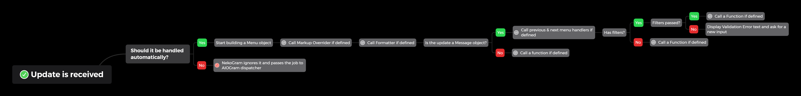

# NekoGram
###### Creating bots has never been simpler\.
##### Join our [Telegram chat @NekoGramDev](https://t.me/NekoGramDev)

##### Example bot: [InPostBot](https://github.com/lyteloli/InPostBot)

## Overview
The idea of NekoGram is to let developers write code as little as possible but still be able to implement complex 
solutions\.\
NekoGram is based on [AIOGram](https://github.com/aiogram/aiogram) which means you can use all its features\.

# Quick documentation
> Note\: Always read the documentation for the release you are using\, NekoGram is constantly evolving and features may
> become outdated\.

#### Current version: 1.3

## Installation
Required:
```
pip install aiogram
```
Speedups:
```
pip install uvloop ujson cchardet aiodns
```
MySQL storage dependencies:
```
pip install aiomysql
```
PostgreSQL storage dependencies:
```
pip install aiopg
```

## Structure

So what are the “formatter” and “function”\?
What does “build text” mean\?

Ok\. So first you need to create a project\, create a `{file_name}.py` and clone NekoGram there like so\:\


## Neko object
Neko is the core object in the library. It gives you the power you crave for, but be careful, 
**with great power comes great responsibility**.
```python
from NekoGram import Neko
NEKO: Neko = Neko(token='Your bot token here')  # Example Neko object initialization
```
Though from the example above Neko initialization seems a piece of cake, it has a lot of options to play with:
- storage: See [storages](#storages) reference
- token: Telegram bot token
- bot: Aiogram Bot object
- dp: Aiogram Dispatcher object
- only_messages_in_functions: Set True if you want to get only messages in your functions (see [functions](#functions) reference)
- start_function: Allows you to define a custom start function and pass it here
- menu_prefix: If you don't want to use `menu_` as a prefix for every menu you can choose your own prefix instead

> You have to pass only one parameter among `token`, `bot` and `dp`. This is for your convenience. For example if a Bot 
> object is not used in your code you don't need to initialize it, just pass a token and NekoGram will do everything 
> for you\.

## Texts
Texts are one of the core parts of NekoGram\. Right now only JSON texts are supported.\
Here is the structure you have to use to build your texts\:
```json
{
  "lang": "en",
  "{text_name}": {
    "text": "{text}",
    "alt_text": "{text}",
    "markup": [
      [{"text": "Button text", "call_data": "Some callback data here", "url": "URL here"}],
      [{"text": "Also button text but this is a reply markup button"}]
    ],
    "parse_mode": null,
    "no_preview": null,
    "silent": null,
    "markup_row_width": 3,
    "allowed_items": ["{values}"],
    "filter_args": ["{values}"],
    "markup_type": "reply",
    "wrong_content_type_text": "{text}",
    "back_menu": "{menu_name}"
  }
}
```
#### Explanation\:
##### `str` lang
###### The ISO code of your translations file\, defined only once per file

##### `str` text\_name
###### The name of your text\.

##### `Optional[str]` text
###### The text shown to user\. You may use {0} positional formatting or {keyword} formatting\.

##### `Optional[str]` alt_text
###### Same as text but an alternative one\, in case you want to switch to a different text within the same menu\.
> Switch between alt_text and text use BuildResponse.switch_alt_text() method.

##### `Optional[Union[Dict[str, str], List[str]]]` markup
###### The markup shown to user\. Can be\:
- Dict for inline keyboard \(key will be call data and value will be the button text\)
- List of strings for reply keyboard \(button texts\)\.

##### `Optional[str]` parse\_mode
###### [Parse mode](https://core.telegram.org/bots/api#formatting-options) to use\. Can be\:
- HTML
- MarkdownV2

##### `Optional[bool]` no\_preview
###### Set `true` if you want to hide link previews in the message\.

##### `Optional[bool]` silent
###### Set `true` if you don't want any notifications when the message is delivered\.

##### `Optional[int]` markup\_row\_width
###### Maximal number of buttons in a single row\.

##### `Optional[List[str]]` allowed\_items
###### A list of allowed content types from user\. See the [Functions](#functions) section\.

##### `Optional[List[str]]` filter_args
###### A list of parameters to pass to content type filters\. See the [Functions](#functions) section\.

##### `Optional[str]` markup\_type
###### The type of specified markup\. Can be `reply` or `inline`\, defaults to `inline`\.

##### `Optional[str]` wrong\_content\_type\_text
###### A menu that should be presented to user in case of wrong input instead of a default one

##### `Optional[str]` back\_menu
###### A menu that should be presented to user after clicking the `back button`

#### Load your texts into Neko\:
```python
from NekoGram import Neko

NEKO = Neko(...)
NEKO.add_texts()
```
> Remember to load your texts before you start your bot\. You can load them dynamically in runtime though\.

### More on markup
As you can see the markup format is a bit different from the native Telegram format (since NekoGram 1\.1)\.
This is to allow you to build dynamic menus easily\. The format is `"markup": [ [ {"key": "value"} ] ]` where keys and 
values can be\:
- `str` text \- your text
- `Optional[str]` call_data \- your callback data
- `Optional[str]` url \- a URL if your button should be a URL button
- `Optional[int]` id \- a button id \(to show exact buttons\)
- `Optional[str]` query \- an inline query \(user will be required to select a chat where to paste the query\)
- `Optional[str]` cc_query \- an inline query \(the query will be pasted in the current chat\)

The `id` might have caught your attention\, you will find this useful in bots with multiple user types
such as admin\, user\, super admin etc\.\
So for each button that should be displayed only to admins and super admins you can set `id` to be equal to any string.
After that in a formatter you call `assemble_markup` method and specify your `allowed_buttons` there\. 
Unlisted buttons in the `allowed_buttons` after assembling the markup will not be shown\.
> Remember you can\'t have text buttons in inline keyboards and either `call_data`, `url`, `query` or `cc_query` 
> has to be specified\.

## Formatters
Every single time when a text gets built a formatter is called \(in case such formatter is registered\)
So let\'s say we have a piece of the following texts\:
```json
{
  "menu_favorite_pet": {
    "text": "Your current favorite pet is {pet_name}",
    "markup": [
      [{"text": "I now have another favorite pet", "call_data": "menu_set_favorite_pet"}]
    ]
  }
}
```
You can see that `{pet_name}` looks like there should be a value\, and that\'s just right\.
That\'s what we use formatters for\, so basically they format a given menu\.\
Formatters accept the following positional arguments\:
- BuildResponse subclass of Neko class instance \(NekoGram\.BuildResponse\)
- Aiogram user \(aiogram\.types\.User\) instance
- Neko class instance \(NekoGram.Neko\)

So here\'s an example of formatter to fill the menu above\:
```python
from NekoGram import Neko, types, BuildResponse
NEKO = Neko(...)

# Note: If your formatter has a unique name you can ignore “name” parameter
@NEKO.formatter(name='menu_favorite_pet')  # Pass the menu name to the “name” argument
async def _(data: BuildResponse, user: types.User, neko: Neko):
    user_data = await neko.storage.get_user_data(user_id=user.id)
    await data.data.assemble_markup(text_format={'pet_name': user_data.get('favorite_pet', 'unknown')})
    # Optional return, not required here:
    # return data
```
> Note\: you can replace `from aiogram import types` with `from NekoGram import types`\.

You are not required to return anything but in case the `Neko.BuildResponse` has changed you can return it\, so 
it will be replaced\.
If you know this menu is being called from a CallbackQuery and want to answer it with the text of a menu you can 
add the following to your formatter\:
```python
data.data.extras['answer_call'] = True
```
If you want the call to only be answered and no messages sent\/edited add the following line as well\:
```python
data.data.extras['answer_only'] = True
```
Or simply use this method\:
```python
data.data.answer_menu_call(answer=True, answer_only=True)
```
> Note\: answer\_menu\_call method works only in formatters\.

## Functions
Here\'s how functions work\:

In your texts you can define `allowed_items` key-value pair which will indicate that we expect certain input from user\.
You define it as a list of allowed Telegram content types and custom filters like `text`\, `photo`\, `any`\, `int`\, 
`float`\, `http_url`\, `https_url`\, `tg_url`\, `url`\, etc\.
> Note\: There are a few built-in content filters\, you can find them in NekoGram\/type_filters\.py\.

#### Create your own content type filters\:
To do so\, define a function that accepts the first positional parameter of type
`Union[aiogram.types.Message, aiogram.types.CallbackQuery]` and, if required, some custom ones 
and returns a bool \(True on match\)\. \
See examples and default filters in NekoGram\/type\_filters\.py

What happens if we expect a photo and user sends text? NekoGram will automatically build the `wrong_content_type`
\(if `wrong_content_type_text` was not specified in your menu\) text and respond to the user\.
> Note\: all the values of `allowed_items` should be names of existing content filters\.

When an input is received from a user your function gets called\.\
Functions accept the following positional arguments\:
- BuildResponse subclass of Neko class instance \(Neko\.BuildResponse\)
- Aiogram Message or CallbackQuery instance
- Neko class instance
Here's an example of function implementation\:
```python
from typing import Union
from NekoGram import Neko, types, BuildResponse
NEKO = Neko(...)


@NEKO.function(name='menu_something')  # Pass the menu name to the “name” argument
async def _(data: BuildResponse, message: Union[types.Message, types.CallbackQuery], neko: Neko):
    # Return True if you want start menu to be shown to a user
    pass
```
> Note\: If your function has a unique name you can omit the “name” parameter\.


## Importing functions and formatters from different files
At first you may want to import all the functions to a single main file and register them all right there\.
It will work of course but it\'s neither scalable nor convenient\. In NekoGram we have a router implementation\.

Here\'s how our file with functions\/formatters would look like\:
```python
# file1.py
from typing import Union
from NekoGram import NekoRouter, Neko, types, BuildResponse

router = NekoRouter()


@router.function()
async def _(data: BuildResponse, message: Union[types.Message, types.CallbackQuery], neko: Neko):
    # Do some stuff here
    pass
```
> Note\: You can assign content filters to your router as well\.

And here\'s the main file\:
```python
from NekoGram import Neko
from file1 import router as file_1_router

NEKO: Neko = Neko(...)

file_1_router.attach_router(neko=NEKO)
```

## Storages
Storages are one of the core parts of NekoGram, you use them to store all the data in your bot\.\
Currently NekoGram has the following storages\:
- MySQLStorage \- `from NekoGram.storages.mysql import MySQLStorage`
- PGStorage \- `from NekoGram.storages.pg import PGStorage`
 ⚠️This storage was not tested and may not work as desired
- BaseStorage \- `from NekoGram.storages import BaseStorage`
 ⚠️This is a memory storage\, it does not save data permanently
  
## The true juice of NekoGram
Now we talk real business\. Why is NekoGram the fastest\, easiest and most effective way to develop a Telegram bot\? \
Meet the stepped menus\! Means\? No functions and formatters are required for sequenced menus\. 
Here is an example of a small form\:
```json
{
 "menu_form_step_1": {
  "text": "Hello, what's your name?",
  "markup": [
      [{"text": "⬅️Back"}]
  ],
   "allowed_items": ["text"],
   "markup_type": "reply"
 },
 "menu_form_step_2": {
  "text": "Ok, what's the cutest animal in your opinion?",
  "markup": [
      [{"text": "⬅️Back"}]
  ],
   "allowed_items": ["text"],
   "markup_type": "reply"
 }
}
```
Now let us read the received data and return our user to the start menu\:
```python
@NEKO.function(name='menu_new_repo_step_2')
async def _(_: BuildResponse, message: types.Message, neko: Neko):
    db_data = await neko.storage.get_user_data(user_id=message.from_user.id)
    user_name = db_data['menu_form_step_1']['text']
    cutest_animal = db_data['menu_form_step_2']['text']
    # DO THE REST OF STUFF
    return True  # To display a start menu to a user
```
> Note\: We only define a function for the last step of a menu\, you can still define functions for steps required but
> in this case you'll have to display the next step of the menu manually\. 

## Extras
#### Call data
NekoGram provides you an easy way to put parameters into callback queries\.\
To get set your parameter just pass it in the text name after `#` like this\:
```json
{
  "menu_buy_dog_snacks": {
    "text": "How many bags of dog snacks would you like to order?",
    "markup": [
      [{"text": "1", "call_data": "menu_checkout#1"}],
      [{"text": "5", "call_data": "menu_checkout#5"}],
      [{"text": "Your entire stock!", "call_data": "menu_checkout#all"}]
    ]
  }
}
```
You can see the parameters are passed after `#`\. Now let\'s get the parameters in our `menu_checkout` formatter\:
```python
from typing import Optional, Union
from NekoGram import Neko, types, BuildResponse
NEKO = Neko(...)


@NEKO.formatter()
async def _(data: BuildResponse, user: types.User, neko: Neko):
    number_of_bags: Optional[Union[str, int]] = data.data.call_data
    # number_of_bags can be 1, 5, all or None
    if number_of_bags is None:  # Make sure it's not None
        return

    # Do some stuff here
```
> You can get call data both in functions and formatters\.

So why is the `number_of_bags` marked optional\?\
This is to let you safely get `call_data` even in menus where it can be absent\.\
If no parameters are passed `data.data.call_data` will be `None`\.
#### Pulling a Neko object from context
If there\'s a case when you manually register a vanilla aiogram handler and want to use NekoGram functionality you can 
always grab Neko class out of context. Here\'s an example\:
```python
from NekoGram import Neko, types
NEKO = Neko(...)


@NEKO.dp.message_handler(content_types=types.ContentType.TEXT)
async def _(message: types.Message):
    neko: Neko = message.conf['neko']  # Get a Neko instance
    data = await neko.build_text(text='text_name', user=message.from_user)  # Build a text
    # Reply to user's message
    await message.reply(text=data.data.text, parse_mode=data.data.parse_mode,
                        disable_web_page_preview=data.data.no_preview, reply=False,
                        disable_notification=data.data.silent, reply_markup=data.data.markup)
```
#### Pagination
You can easily paginate your menus using `add_pagination` method like this\:
```python
from NekoGram import Neko, types, BuildResponse
from typing import Union
NEKO = Neko(...)

@NEKO.function(name='some_name')
async def _(data: BuildResponse, message: Union[types.Message, types.CallbackQuery], neko: Neko):
    offset = data.data.call_data  # ! Make sure offset is not None
    data = await neko.build_text(text='text_name', user=message.from_user)
    # Do the rest (fetch data, build a markup) here
    found: int = 20  # Number of found values
    await data.data.add_pagination(offset=offset, found=found, limit=25)
```
> Call `add_pagination` only before you call `assemble_markup`\.

#### Force message deletion in callback handling
Sometimes after formatting you may want a message to be resent\, simply use `delete_and_send` function\:
```python
data = await neko.build_text(text='text_name', user=message.from_user)
data.data.delete_and_send()
```

#### Changing user language
Since NekoGram caches user's language to reduce the number of database queries you should not do it manually using the 
preferred storage\.\
Instead you have to use the following method\:
```python
from NekoGram import Neko
neko = Neko(...)

await neko.set_user_language(user_id=0, language='en')
```
