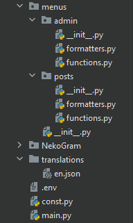

# NekoGram
###### Creating bots has never been simpler\.

## Overview
The idea of NekoGram is to let developers write code as little as possible but still be able implement complex 
solutions\.\
NekoGram is based on [AIOGram](https://github.com/aiogram/aiogram) which means you can use all its features\.

# Quick documentation

## Structure

So what are the “formatter” and “function”\?
What does “build text” mean\?

Ok\. So first you need to create a project\, create a `{file_name}.py` and clone NekoGram there like so\:\


## Texts
Texts are one of the core parts of NekoGram\. Right now only JSON texts are supported.\
Here is the structure you have to use to build your texts\:
```json
{
  "{text_name}": {
    "text": "{text}",
    "markup": [
      {"{callback_data}": "{button_text}"},
      ["{button_text}", "{button_text}"]
    ],
    "parse_mode": null,
    "no_preview": null,
    "silent": null,
    "markup_row_width": 3,
    "allowed_items": ["{values}"]
  }
}
```
Explanation\:
##### `str` text_name
###### The name of your text\.

##### `Optional[str]` text
###### The text shown to user\. You may use {0} positional formatting or {keyword} formatting\.

##### `Optional[Union[Dict[str, str], List[str]]]` markup
###### The markup shown to user\. Can be\:
- Dict for inline keyboard \(key will be call data and value will be the button text\)
- List of strings for reply keyboard \(button texts\)\.

##### `Optional[str]` parse_mode
###### [Parse mode](https://core.telegram.org/bots/api#formatting-options) to use\. Can be\:
- HTML
- MarkdownV2

##### `Optional[bool]` no_preview
###### Set `true` if you want to hide link previews in the message\.

##### `Optional[bool]` silent
###### Set `true` if you don't want any notifications when the message is delivered\.

##### `Optional[int]` markup_row_width
###### Maximal number of buttons in a single row\.

##### `Optional[List[str]]` allowed_items
###### A list of allowed content types from user\. See the [Functions](#functions) section\.

## Formatters
Every single time when a text gets built a formatter is called \(in case such formatter is registered\)
So let\'s say we have a piece of the following texts\:
```json
{
  "menu_favorite_pet": {
    "text": "Your current favorite pet is {pet_name}",
    "markup": [
      {"menu_set_favorite_pet": "I now have another favorite pet"}
    ]
  }
}
```
You can see that `{pet_name}` looks like there should be a value\, and that\'s just right\.
That\'s what we use formatters for\, so basically they format a given menu\.\
Formatters accept the following positional arguments\:
- BuildResponse subclass of Neko class instance \(Neko\.BuildResponse\)
- Aiogram user \(aiogram\.types\.User\) instance
- Neko class instance

So here\'s an example of formatter to fill the menu above\:
```python
# from NekoGram import Neko, types
# neko = Neko(...)

@neko.formatter(name='menu_favorite_pet')  # Pass the menu name to the “name” argument
async def _(data: Neko.BuildResponse, user: types.User, _: Neko):
    user_data = await neko.storage.get_user_data(user_id=user.id)
    await data.data.assemble_markup(text_format={'pet_name': user_data.get('favorite_pet', 'unknown')})
    # Optional return, not required here:
    # return data
```
> Note\: you can replace `from aiogram import types` with `from NekoGram import types`

You are not required to return anything but in case the `Neko.BuildResponse` has changed you can return it so 
it will be replaced\.
If you know this menu is being called from a CallbackQuery and want to answer it with the text of a menu you can 
add the following to your formatter\:
```python
data.data['extras']['answer_call'] = True
```
If you want the call to only be answered and no messages sent\/edited add the following line as well\:
```python
data.data['extras']['answer_only'] = True
```

## Functions
Here\'s how functions work\:

In your texts you can define `allowed_items` key-value pair which will indicate that we expect certain input from user\.
You define it as a list of allowed content types like `text`\, `photo`\, `any`\, etc\.\

What happens if we expect a photo and user sends text? NekoGram will automatically build the `wrong_content_type` 
text and respond to the user\.
> Note\: all the values of `allowed_items` should be lowercase\.

When an input is received from a user your function gets called\.\
Functions accept the following positional arguments\:
- BuildResponse subclass of Neko class instance \(Neko\.BuildResponse\)
- Aiogram Message or CallbackQuery instance
- Neko class instance
Here's an example of function implementation\:
```python
# from typing import Union
# from NekoGram import Neko, types
# neko = Neko(...)

@neko.function(name='menu_something')
async def _(data: Neko.BuildResponse, message: Union[types.Message, types.CallbackQuery], neko: Neko):
    # Return True if you want start menu to be shown to a user
    pass
```

## Extras
If there\'s a case when you manually register a vanilla aiogram handler and want to build a certain text you can 
always grab Neko class out of context. Here\'s an example\:
```python
from NekoGram import Neko, types
NEKO = Neko(...)

@NEKO.dp.message_handler(content_types=types.ContentType.TEXT)
async def _(message: types.Message):
    neko: Neko = message.conf['neko']  # Get a Neko instance
    data = await neko.build_text(text='text_name', user=message.from_user)  # Build a text
    # Reply to user's message
    await message.reply(text=data.data.text, parse_mode=data.data.parse_mode,
                        disable_web_page_preview=data.data.no_preview, reply=False,
                        disable_notification=data.data.silent, reply_markup=data.data.markup)
```